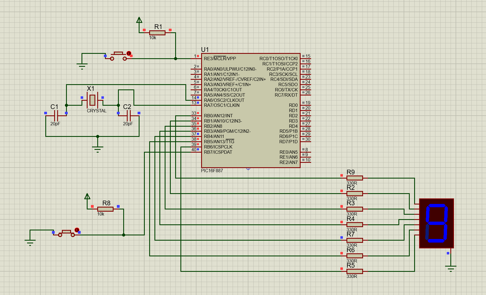

# 7-Segment-Display-with-button

## Description
This project controls a 7-segment display using a push button. The user can manually increment the displayed number from 0 to 9 by pressing the button.

## Circuit
  
*The circuit schematic for the push-button controlled 7-segment display.*

## Files
- `7-Segment-with-button.pdsprj`: Circuit schematic for the push-button and 7-segment display.
- `seven_segment_with_button.c`: MikroC program for controlling the display with a button.

## Instructions
1. open `7-Segment-with-button.pdsprj` on Proteus.
2. Load and compile `seven_segment_with_button.c` in MikroC to create the hex file.
3. Upload the hex file into the microcontroller in Proteus.
4. Press the push button to increment the displayed number.

## Tools
- MikroC Pro for PIC
- Proteus ISIS
